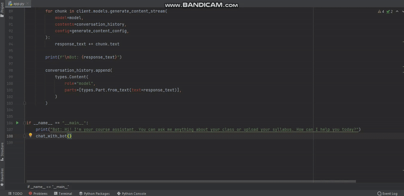

# Course-Assistant-Chatbot

An interactive, PDF-aware AI chatbot designed to help university students with their courses. Students can upload a syllabus, lecture notes, or any course-related PDF, then ask questions or request summaries. The chatbot uses **Google's Gemini API** to provide context-aware, intelligent responses.

---

## 🚀 Features

- 📄 **PDF Upload Support**: Extracts content from uploaded PDFs to answer questions based on actual documents.
- 💬 **Contextual Chat**: Maintains conversation history for smarter, multi-turn interactions.
- 🧠 **Custom System Prompt**: Tailored to act like a friendly and helpful course assistant.
- 🔄 **Streaming Responses**: Generates and displays responses in real time.
- 🧪 **Tools Integration**: Optionally integrates Google Search for broader answer capabilities.

---

## 💻 Demo


---

## 🔑 Get a Google Generative AI API Key

To run this project, you must obtain a free API key from Google:

1. Go to [Google AI Studio](https://makersuite.google.com/app/apikey).
2. Sign in with your Google account.
3. Click on **"Create API key"**.
4. Copy the key and replace it in the code:

```python
client = genai.Client(
    api_key="YOUR_API_KEY_HERE",
)
```
> ⚠️ **Keep your API key secret.** Never share it publicly or upload it to GitHub.

